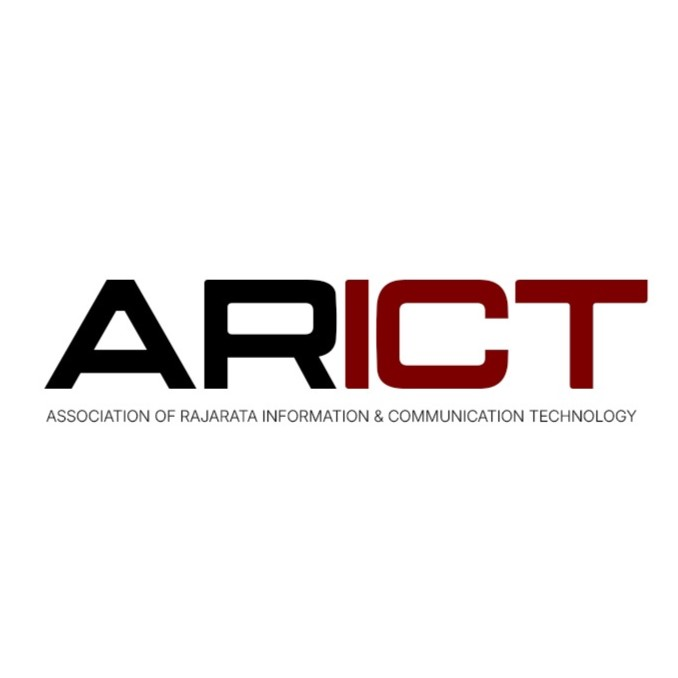

  

<h1 align="center">Association of Rajarata ICT (ARICT)</h1>

Empowering students through technology, innovation, and collaboration.

---

## About Us

The **Association of Rajarata ICT (ARICT)** is a student-driven community at Rajarata University of Sri Lanka.

We focus on:

- Building practical tech skills  
- Encouraging innovation and creativity  
- Connecting students with industry trends  
- Supporting collaboration and teamwork  

---

## What We Do

- Workshops on modern technologies  
- Hackathons and coding competitions  
- Industry talks and networking sessions  
- Open-source contributions  
- UI/UX and software development projects  

---

## Vision

To create a strong tech community that produces skilled, confident, and industry-ready graduates.

---

## Mission

- Help students learn by doing  
- Promote real-world project experience  
- Build a culture of sharing knowledge  
- Encourage leadership and teamwork  

---

## Connect With Us

  

---

## Maintained By

Association of Rajarata ICT  
Rajarata University of Sri Lanka
